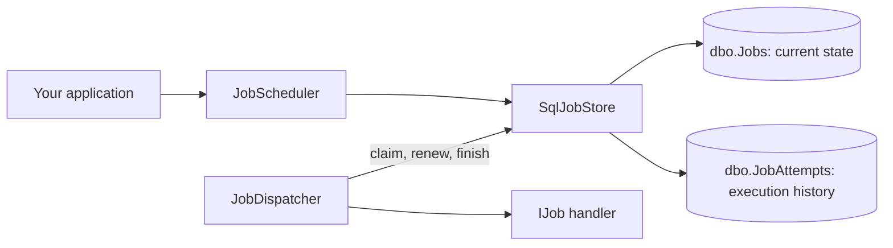

# JobFlow.NET

[](https://github.com/Shivansh-Gaur2/JobFlow.NET/actions/workflows/ci.yml)
[](LICENSE)

JobFlow.NET is a pre-release .NET library for one-time and delayed background jobs backed by SQL Server.

> **Status: pre-release and under active development.** JobFlow uses renewable SQL Server job leases and has automated SQL integration coverage. It still provides at-least-once delivery: job handlers must be safe to run more than once. Do not use it in production yet.

## Why JobFlow.NET?

The project explores a small, explicit job-scheduling model:

- A job implements `IJob` and receives an optional payload plus a cancellation token.
- SQL Server stores jobs and atomically claims ready work for competing workers.
- A hosted dispatcher resolves a fresh job instance from dependency injection for each execution.
- Failed jobs use a configurable retry policy; permanent configuration failures stop immediately.
- Each claim has a lease token. Only the worker holding the current, unexpired token can complete, fail, or renew its job.

The SQL Server store uses `UPDLOCK` and `READPAST` to make claiming a job a single database operation. An expired lease can be reclaimed by another worker. This protects the queue from a crashed worker, but it also means an external side effect (for example, charging a card) must use its own idempotency key.

## Architecture at a glance

The small diagram below shows the important split: `dbo.Jobs` holds the current answer, while `dbo.JobAttempts` records each worker execution.

[Open the interactive architecture diagram](docs/diagrams/jobflow-overview.html)



## Packages

The first public release will be a pre-release package:

- `JobFlow.Core` — job contracts, scheduling API, and hosted dispatcher.
- `JobFlow.SqlServer` — SQL Server store and dependency-injection registration.

```powershell
dotnet add package JobFlow.SqlServer --prerelease
```

## Quick start

Register the SQL Server store and your job type when configuring the host:

```csharp
using JobFlow.Core;
using JobFlow.SqlServer;
using Microsoft.Extensions.DependencyInjection;

builder.Services.UseSqlServerJobStore(
    "Server=localhost,1433;Database=JobFlow;User Id=sa;Password=your-password;TrustServerCertificate=True;");

builder.Services.AddTransient<PrintJob>();
```

Configure the global retry policy when needed. `MaxAttempts` includes the first
execution, so a value of three permits at most three total executions:

```csharp
builder.Services.UseSqlServerJobStore(
    connectionString,
    configureRetryOptions: retry =>
    {
        retry.MaxAttempts = 3;
        retry.BaseDelay = TimeSpan.FromSeconds(2);
        retry.MaxDelay = TimeSpan.FromMinutes(5);
    });
```

Apply the JobFlow SQL migrations before starting workers:

```csharp
var host = builder.Build();

await host.Services.ApplyJobFlowSqlServerMigrationsAsync();
```

Schedule work through `JobScheduler`:

```csharp
var scheduler = host.Services.GetRequiredService<JobScheduler>();

await scheduler.EnqueueAsync<PrintJob>("hello");
await scheduler.ScheduleAsync<PrintJob>(TimeSpan.FromMinutes(5), "run later");
```

`PrintJob` implements `IJob`:

```csharp
public sealed class PrintJob : IJob
{
    public Task ExecuteAsync(string? payload, CancellationToken ct)
    {
        Console.WriteLine(payload);
        return Task.CompletedTask;
    }
}
```

`UseSqlServerJobStore` only registers JobFlow services. Applying migrations is explicit, so production deployments can upgrade the database before workers begin processing jobs.

## Guides

For the details behind the quick start, read the [documentation index](https://github.com/Shivansh-Gaur2/JobFlow.NET/tree/main/docs):

- [Getting started](https://github.com/Shivansh-Gaur2/JobFlow.NET/blob/main/docs/getting-started.md)
- [Delivery and renewable leases](https://github.com/Shivansh-Gaur2/JobFlow.NET/blob/main/docs/delivery-and-leases.md)
- [Idempotent job handlers](https://github.com/Shivansh-Gaur2/JobFlow.NET/blob/main/docs/idempotent-job-handlers.md)
- [Configuration](https://github.com/Shivansh-Gaur2/JobFlow.NET/blob/main/docs/configuration.md)
- [Operations and diagnostics](https://github.com/Shivansh-Gaur2/JobFlow.NET/blob/main/docs/operations-and-diagnostics.md)
- [Troubleshooting](https://github.com/Shivansh-Gaur2/JobFlow.NET/blob/main/docs/troubleshooting.md)

## Repository layout

```text
src/
  JobFlow.Core/       Contracts, scheduling, dispatching, lifecycle, and failure types
  JobFlow.SqlServer/  Registration, SQL store, and embedded versioned migrations
tests/
  JobFlow.SqlServer.Tests/  Real SQL Server integration tests using Testcontainers
samples/
  JobFlow.Sample/     Small host registration and scheduling example
```

## Current requirements

- .NET SDK 9.0 or later to build the full solution.
- SQL Server 2022 or later for the SQL Server provider.
- Docker Desktop to run the SQL Server integration tests. The tests start their own disposable SQL Server container.

## Build locally

```powershell
dotnet restore JobFlow.sln
dotnet build JobFlow.sln --configuration Release --no-restore
dotnet test JobFlow.sln --configuration Release --no-build
```

The test suite exercises real SQL Server behavior through Testcontainers. The sample application in `samples/JobFlow.Sample` shows basic registration and scheduling.

## Roadmap

1. Prove competing-consumer behavior with multiple worker instances.
2. Add recurring jobs using cron expressions.
3. Add a supported read/query API for operations screens instead of requiring direct SQL queries.
4. Add release automation and publish a preview package.
5. Consider additional storage adapters only after the SQL Server behavior is proven.

## Contributing and security

Please read [CONTRIBUTING.md](CONTRIBUTING.md) before opening a pull request. See [SECURITY.md](SECURITY.md) for private vulnerability reporting guidance and [SUPPORT.md](SUPPORT.md) for questions.

## License

Licensed under the [MIT License](LICENSE).
